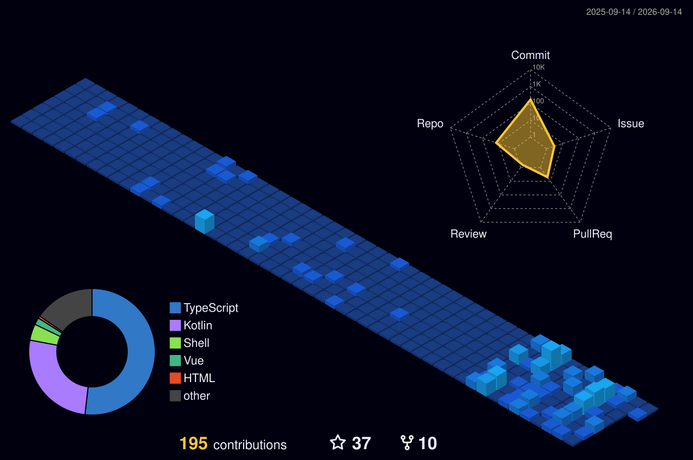

  <h1>Hi, I'm piter 👋</h1>

  

    <b>Cybersecurity Learner · CTF Player · C & Python Developer</b>
  

  

    Learning by breaking, building and documenting.
  

  

    

  <i>「我们都是阴沟里的虫子，但总还是得有人仰望星空。」</i>

---

### A Little About Me

- 🔐 Learning **Web Security** through CTF challenges and hands-on labs
- 🧩 Exploring **Web Pentesting & Binary Exploitation**
- 🛠️ Building and experimenting with **C, Python and Linux**
- ✍️ Writing **CTF write-ups, technical notes and occasional thoughts** at [piterの小窝](https://npiter.de)

### Languages & Environment

  

### Security Toolkit

  
  
  
  
  
  

### Find Me

  
  
  
  

### GitHub Statistics & Activity

  
  

  

### Contribution Activity

  <picture>
    <source
      media="(prefers-color-scheme: dark)"
      srcset="https://raw.githubusercontent.com/Nshpiter/Nshpiter/output/github-contribution-grid-snake-dark.svg"
    />
    <source
      media="(prefers-color-scheme: light)"
      srcset="https://raw.githubusercontent.com/Nshpiter/Nshpiter/output/github-contribution-grid-snake.svg"
    />
    
  </picture>

